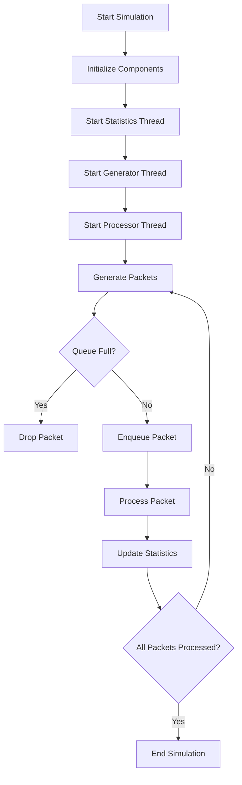
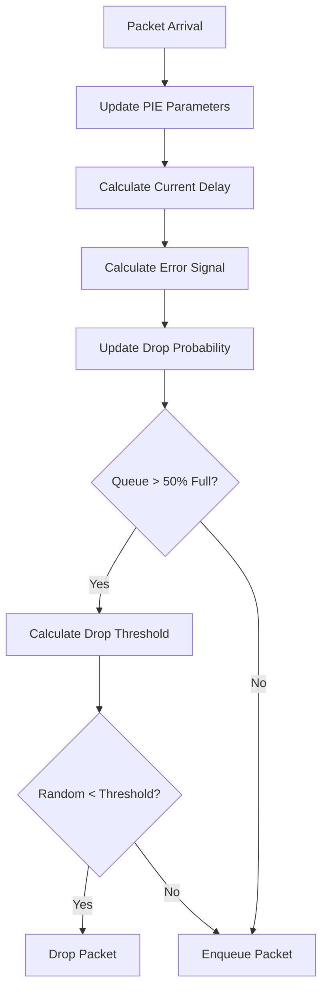

# Network Queue Management Simulation

## Table of Contents
1. [Project Overview](#project-overview)
2. [Algorithms](#algorithms)
   - [FIFO Algorithm](#fifo-algorithm)
   - [PIE Algorithm](#pie-algorithm)
3. [Project Structure](#project-structure)
4. [Implementation Details](#implementation-details)
5. [Flow Diagrams](#flow-diagrams)
6. [Usage](#usage)
7. [Results and Analysis](#results-and-analysis)

## Project Overview

This project implements a network queue management simulation comparing two algorithms:
- First-In-First-Out (FIFO)
- Proportional Integral controller Enhanced (PIE)

The simulation models a network node with packet queuing, processing, and transmission capabilities.

## Algorithms

### FIFO Algorithm

FIFO (First-In-First-Out) is the simplest queue management algorithm where packets are processed in the order they arrive.

#### Key Characteristics:
- Simple implementation
- No packet prioritization
- Fixed queue capacity
- Tail-drop when queue is full

#### Mathematical Model:
```
Queue State:
Q(t) = min(Q(t-1) + A(t) - D(t), C)

Where:
Q(t) = Current queue size
A(t) = Arriving packets
D(t) = Departing packets
C = Queue capacity
```

### PIE Algorithm

PIE (Proportional Integral controller Enhanced) is an active queue management algorithm that uses control theory to maintain a target delay.

#### Key Components:

1. **Delay Calculation**:
```
current_delay = current_time - packet_arrival_time
```

2. **Error Signal**:
```
delay_error = current_delay - target_delay
queue_error = (current_queue_size - previous_queue_size) / capacity
total_error = delay_error + queue_error
```

3. **Drop Probability Update**:
```
drop_probability += (α * error + β * accumulated_error)

Where:
α = Proportional gain (0.125)
β = Integral gain (1.25)
accumulated_error += error * time_diff
```

4. **Dynamic Drop Threshold**:
```
drop_threshold = drop_probability * (current_queue_size / capacity)
```

## Project Structure

```
project/
├── main.py           # FIFO implementation
├── pie_main.py       # PIE implementation
├── dataset/          # Input data files
│   ├── bulk_ftp.csv
│   └── bulk_115s_01.csv
└── README.md
```

### Class Hierarchy

```
Simulation
├── EventLogger
├── PacketQueue/PIEQueue
├── NetworkLink
└── StatisticsCollector
    └── Plotting Functions
```

## Implementation Details

### Core Classes

1. **Packet**
   - Represents network packets
   - Tracks timing information
   - Stores packet properties

2. **EventLogger**
   - Thread-safe event logging
   - Timestamp management
   - File and console output

3. **NetworkLink**
   - Simulates network transmission
   - Handles latency and bandwidth
   - Thread-safe operations

4. **Queue Management**
   - FIFO: Simple queue with tail-drop
   - PIE: Active queue management with delay control

5. **StatisticsCollector**
   - Real-time statistics tracking
   - Performance metrics
   - Visualization tools

## Flow Diagrams

### Main Simulation Flow


### PIE Algorithm Flow


## Usage

1. **Running FIFO Simulation**:
```bash
python main.py
```

2. **Running PIE Simulation**:
```bash
python pie_main.py
```

### Configuration Parameters

```python
simulation = Simulation(
    queue_capacity=500,      # Queue size in packets
    network_speed=100000,    # Network speed in bytes/s
    generation_speed=0.02,   # Packet generation interval
    csv_file="dataset/bulk_ftp.csv"
)
```

## Results and Analysis

### Performance Metrics

1. **Throughput**
   - Packets processed per second
   - Network utilization

2. **Queue Statistics**
   - Queue size over time
   - Average queue delay
   - Drop probability

3. **Processing Metrics**
   - Average processing time
   - Total packets processed
   - Total packets dropped

### Visualization

The simulation generates four plots:
1. Throughput over time
2. Queue size over time
3. Drop probability over time
4. Queue delay over time

## Future Improvements

1. Additional queue management algorithms
2. More sophisticated traffic patterns
3. Network topology simulation
4. Real-time visualization
5. Performance optimization

## References

1. RFC 8033 - PIE: A Lightweight Control Scheme to Address the Bufferbloat Problem
2. Network Queue Management: A Comprehensive Guide
3. Active Queue Management: Principles and Practice 