# Network Queue Management Simulation - Visual Documentation

## System Architecture

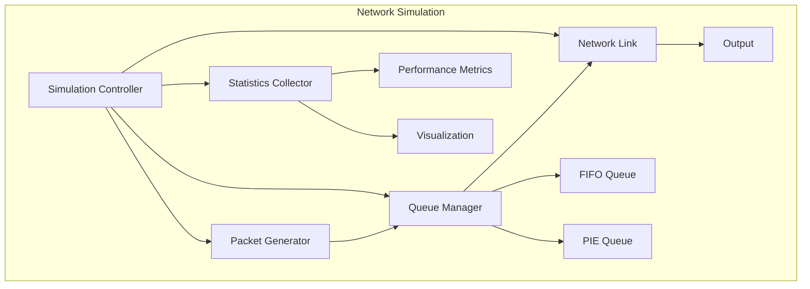

## Packet Lifecycle

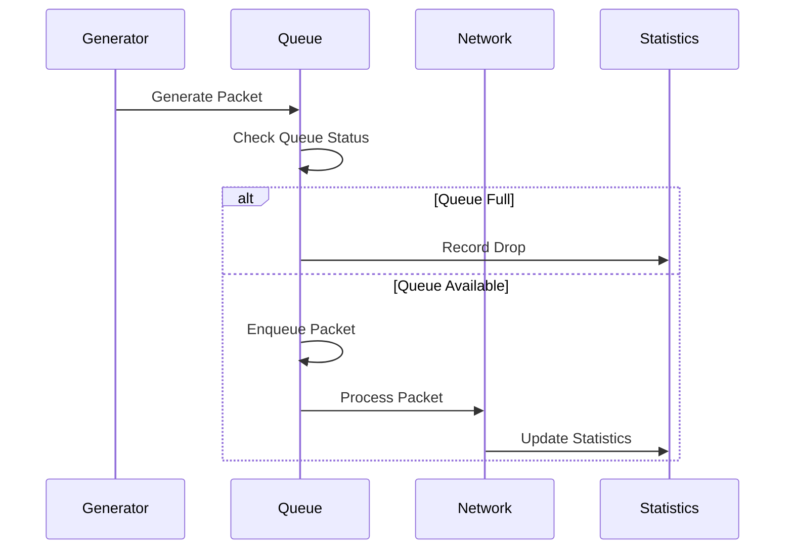

## FIFO vs PIE Comparison

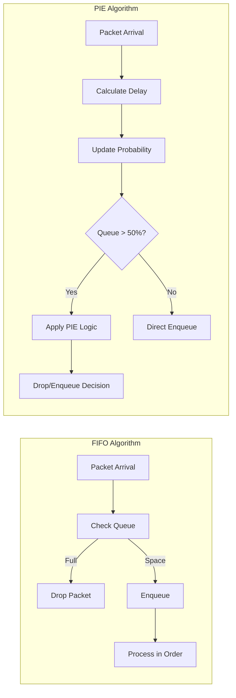

## Performance Metrics Visualization

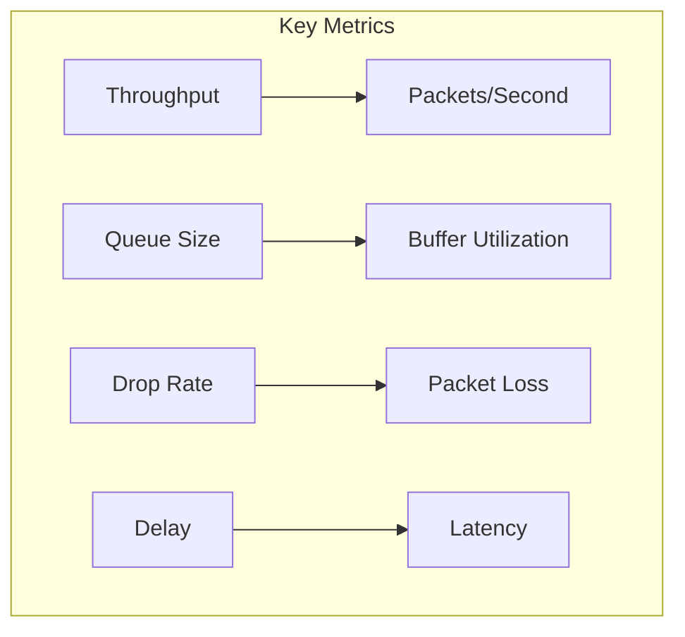

## Queue State Transitions

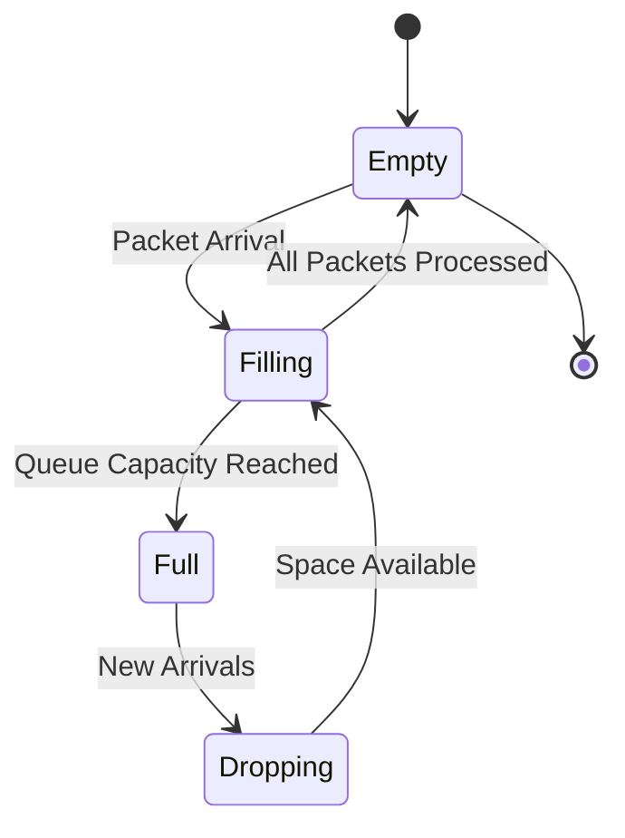

## PIE Control Loop

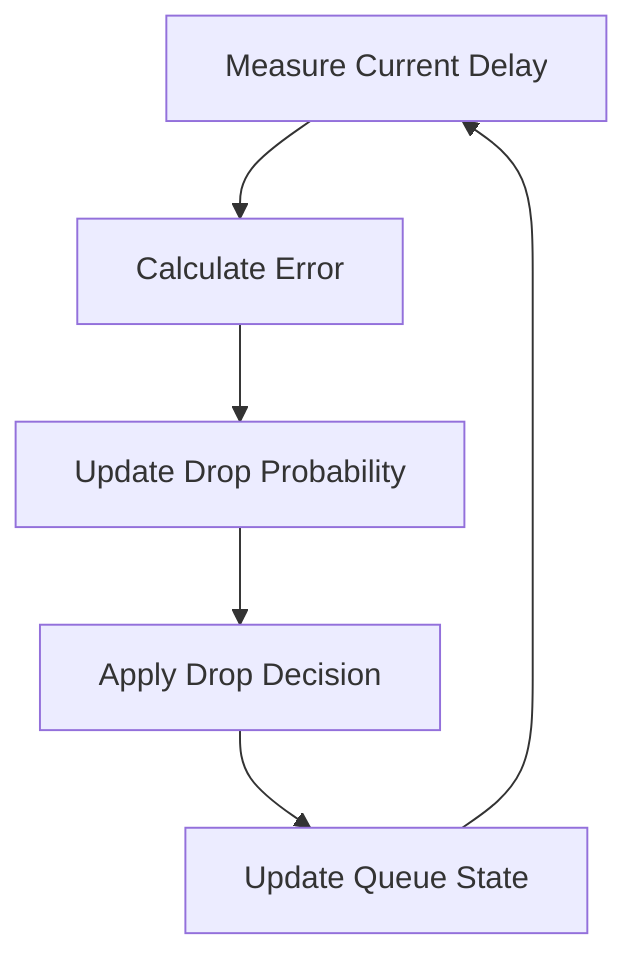

## ASCII Art: Network Node

```
    +------------------+
    |   Network Node   |
    +------------------+
           |
    +------+------+
    |    Queue    |
    +------+------+
           |
    +------+------+
    |   Network   |
    +------+------+
```

## ASCII Art: Packet Flow

```
    Generator --> [Queue] --> Processor
       |            |           |
       v            v           v
    [Create]    [Buffer]    [Process]
       |            |           |
       +------------+-----------+
                    |
                    v
                [Network]
```

## Performance Comparison Chart

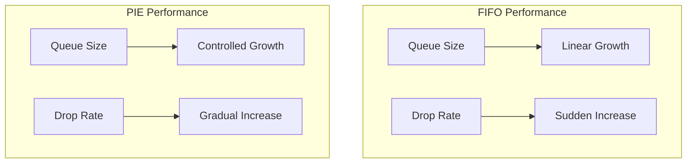

## Implementation Flow

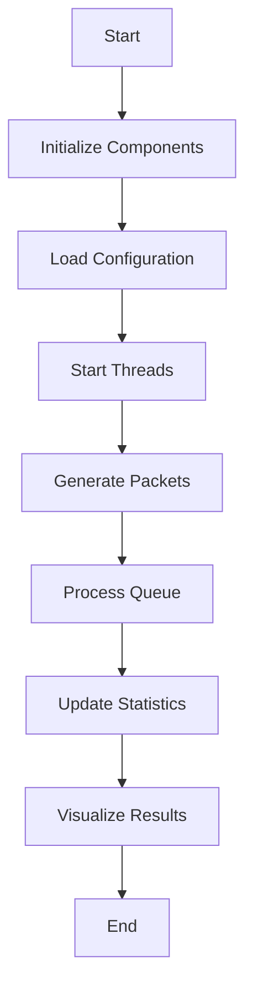

## Class Relationships

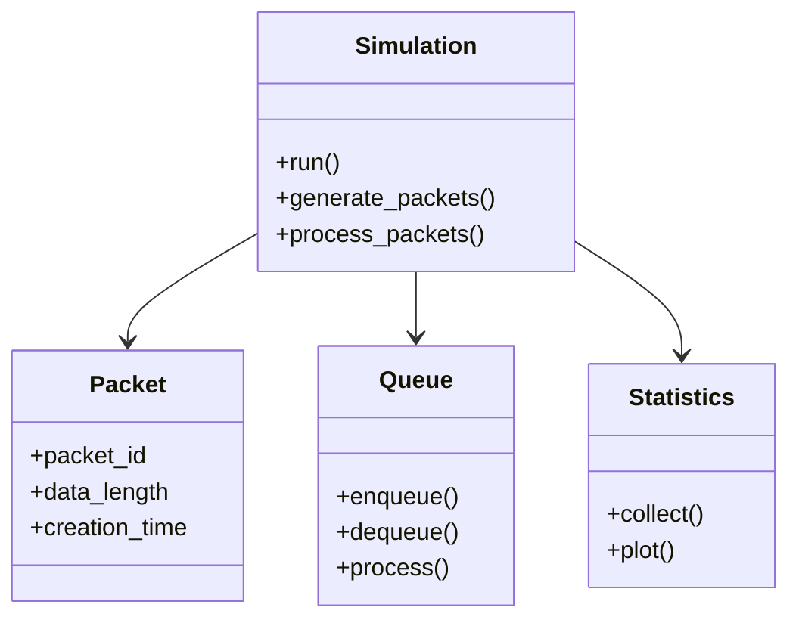

## Network Topology

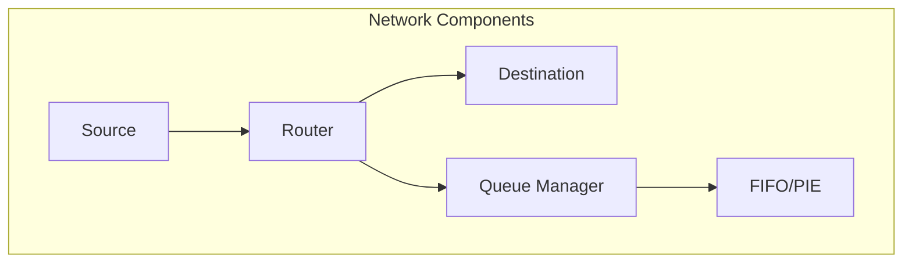

## Performance Metrics Dashboard

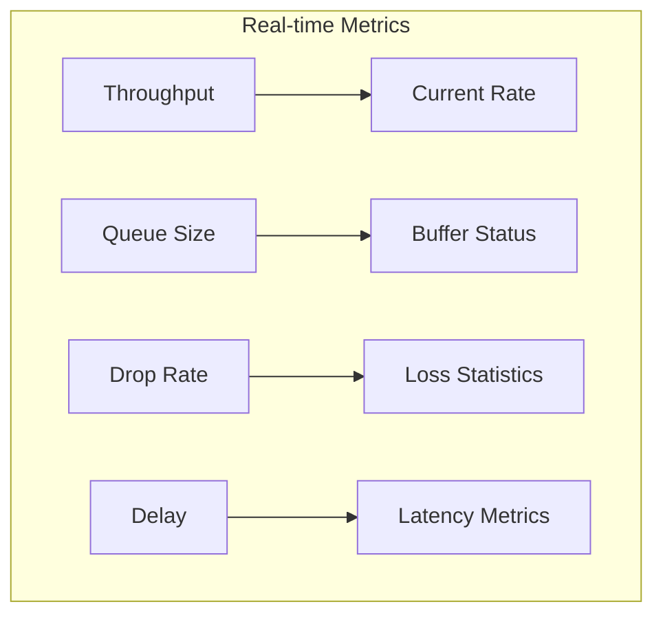

## Configuration Parameters

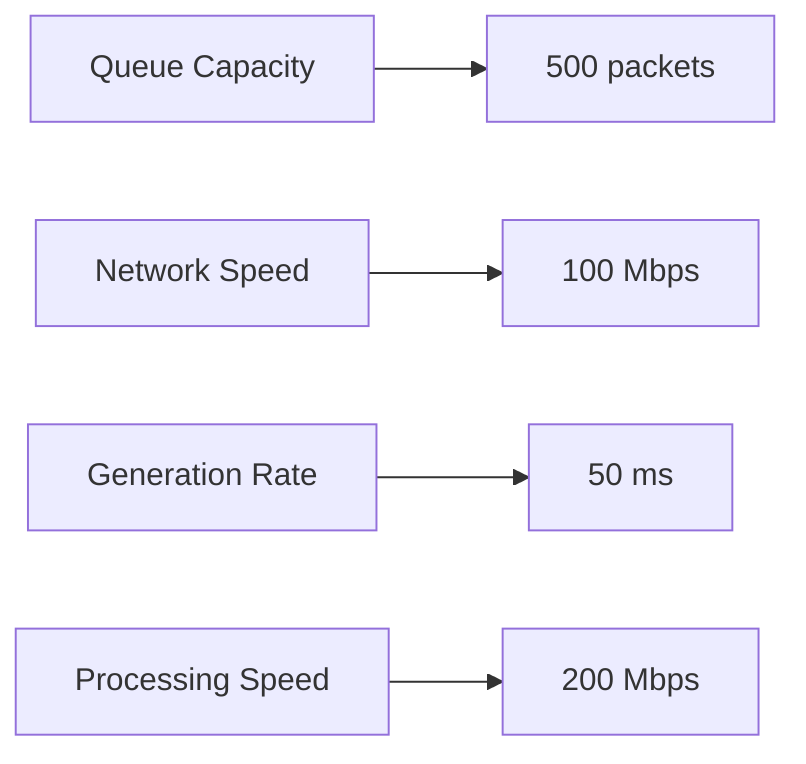

## Error Handling Flow

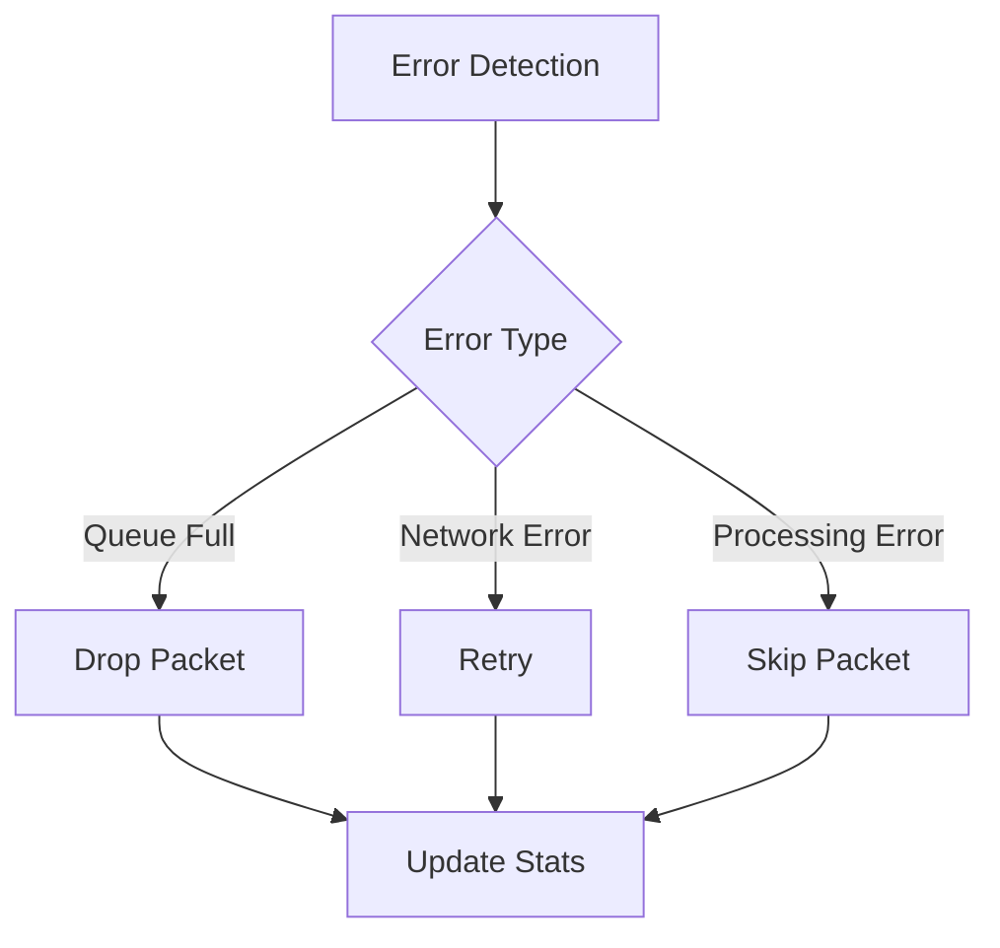

## Thread Management

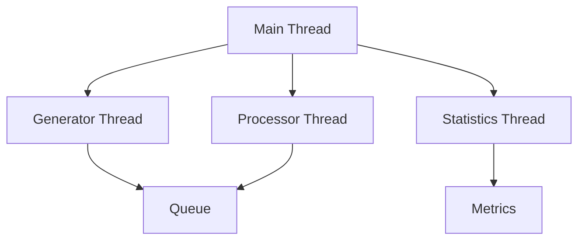

These diagrams provide a comprehensive visual representation of:
1. System architecture
2. Algorithm flows
3. Performance metrics
4. Implementation details
5. Network topology
6. Thread management
7. Error handling
8. Configuration parameters

The diagrams use Mermaid syntax which can be rendered by many Markdown viewers and documentation systems. They provide both high-level overview and detailed implementation views of the system.

Would you like me to:
1. Add more specific diagrams for any component?
2. Create additional performance visualization charts?
3. Add more detailed flow diagrams?
4. Include more ASCII art representations?

Let me know what aspects you'd like me to enhance or clarify further. 