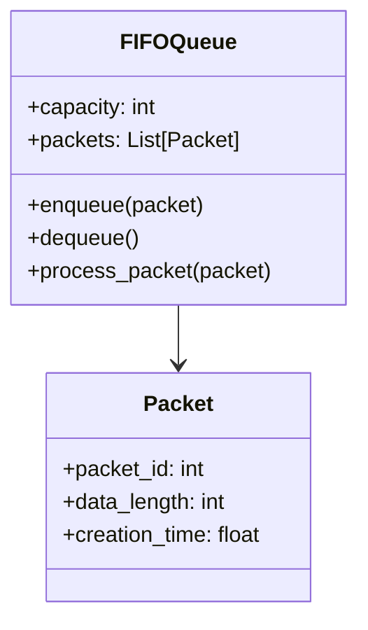

# FIFO Algorithm

[Back to Project Overview](project.md)

## FIFO Class Diagram

## Description
FIFO (First-In-First-Out) is a simple queue management algorithm where packets are processed in the order they arrive. If the queue is full, new packets are dropped (tail-drop). 