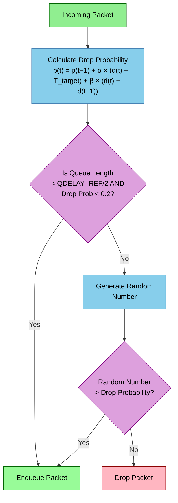

```mermaid
flowchart TD
    P[Incoming Packet] --> D["Calculate Drop Probability
    p(t) = p(t−1) + α × (d(t) − T_target) + β × (d(t) − d(t−1))"]
    
    D --> W{"Is Queue Length
    < QDELAY_REF/2 AND
    Drop Prob < 0.2?"}
    
    W -->|Yes| E["Enqueue Packet"]
    W -->|No| R["Generate Random
    Number"]
    
    R --> RD{"Random Number
    > Drop Probability?"}
    
    RD -->|Yes| E
    RD -->|No| Dr["Drop Packet"]
    
    style P fill:#90EE90,stroke:#006400,color:#000000
    style E fill:#98FB98,stroke:#006400,color:#000000
    style Dr fill:#FFB6C1,stroke:#8B0000,color:#000000
    style D fill:#87CEEB,stroke:#4682B4,color:#000000
    style W fill:#DDA0DD,stroke:#800080,color:#000000
    style R fill:#87CEEB,stroke:#4682B4,color:#000000
    style RD fill:#DDA0DD,stroke:#800080,color:#000000
```
