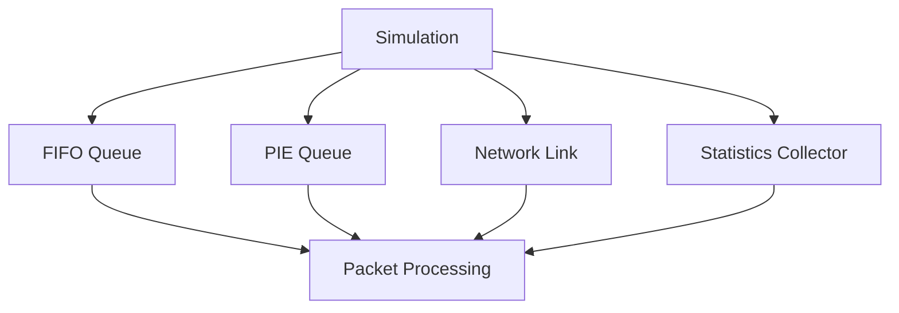

# Project Overview

Welcome to the Network Queue Management Simulation project!

## Navigation
- [FIFO Algorithm](fifo.md)
- [Project Structure](structure.md)
- [Simulation Flow](simulation.md)

## System Overview

This project simulates and compares FIFO and PIE queue management algorithms in a network environment. Use the links above to explore specific aspects of the project. 