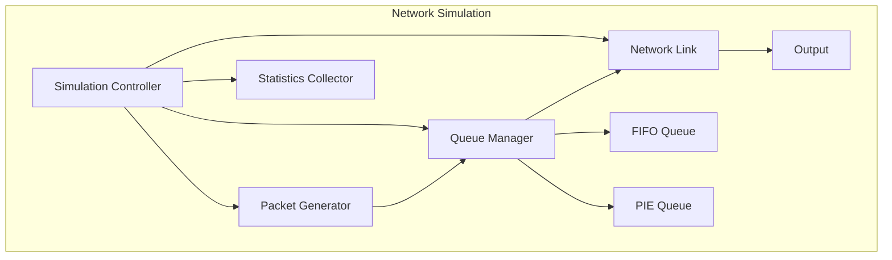

# Network Queue Management Simulation
## Technical Documentation

## Table of Contents
1. [Executive Summary](#executive-summary)
2. [Introduction](#introduction)
3. [System Architecture](#system-architecture)
4. [Implementation Details](#implementation-details)
5. [Algorithms](#algorithms)
6. [Performance Analysis](#performance-analysis)
7. [Results and Discussion](#results-and-discussion)
8. [Future Work](#future-work)
9. [References](#references)

## Executive Summary

This document presents a comprehensive analysis of a network queue management simulation system that implements and compares two queue management algorithms: First-In-First-Out (FIFO) and Proportional Integral controller Enhanced (PIE). The system provides a detailed simulation environment for analyzing network performance under different queue management strategies.

## Introduction

### Problem Statement
Network congestion and bufferbloat are significant challenges in modern networking. This project addresses these issues by implementing and comparing two queue management algorithms:
- FIFO: A simple, traditional approach
- PIE: An advanced Active Queue Management (AQM) algorithm

### Objectives
1. Implement and compare FIFO and PIE algorithms
2. Analyze performance metrics
3. Evaluate queue management effectiveness
4. Provide visualization tools
5. Generate comprehensive statistics

## System Architecture

### Overview
The system consists of several key components:
1. Simulation Controller
2. Packet Generator
3. Queue Manager
4. Network Link
5. Statistics Collector

### Component Diagram


## Implementation Details

### Core Classes

#### 1. Packet Class
```python
@dataclass
class Packet:
    packet_id: int
    data_length: int
    creation_time: float
    arrival_time: float = 0
    start_processing_time: float = 0
    completion_time: float = 0
    delete_time: float = 0
```

#### 2. Queue Management
- FIFO Implementation
- PIE Implementation
- Thread-safe operations
- Statistics tracking

#### 3. Network Components
- Network Link simulation
- Bandwidth management
- Latency handling

### Thread Management
The system uses three main threads:
1. Generator Thread
2. Processor Thread
3. Statistics Thread

## Algorithms

### FIFO Algorithm

#### Implementation
```python
def enqueue(self, packet: Optional[Packet]) -> bool:
    with self.lock:
        if not self.is_full():
            self.items.append(packet)
            return True
        return False
```

#### Mathematical Model
```
Queue State:
Q(t) = min(Q(t-1) + A(t) - D(t), C)

Where:
Q(t) = Current queue size
A(t) = Arriving packets
D(t) = Departing packets
C = Queue capacity
```

### PIE Algorithm

#### Key Components
1. Delay Calculation
2. Error Signal Generation
3. Drop Probability Update
4. Dynamic Threshold Adjustment

#### Implementation
```python
def update_pie_parameters(self, current_time: float) -> None:
    # Calculate current delay
    current_delay = current_time - packet_arrival_time
    
    # Calculate error
    error = current_delay - target_delay
    
    # Update drop probability
    self.drop_probability += (α * error + β * accumulated_error)
```

## Performance Analysis

### Metrics
1. Throughput
   - Packets processed per second
   - Network utilization

2. Queue Statistics
   - Queue size over time
   - Average queue delay
   - Drop probability

3. Processing Metrics
   - Average processing time
   - Total packets processed
   - Total packets dropped

### Visualization
The system generates four key plots:
1. Throughput over time
2. Queue size over time
3. Drop probability over time
4. Queue delay over time

## Results and Discussion

### FIFO Performance
- Linear queue growth
- Sudden drop rate increase
- Fixed buffer utilization

### PIE Performance
- Controlled queue growth
- Gradual drop rate adjustment
- Dynamic buffer management

### Comparative Analysis
| Metric | FIFO | PIE |
|--------|------|-----|
| Queue Growth | Linear | Controlled |
| Drop Rate | Sudden | Gradual |
| Delay Control | None | Active |
| Implementation | Simple | Complex |

## Future Work

### Planned Improvements
1. Additional AQM algorithms
2. Enhanced traffic patterns
3. Network topology simulation
4. Real-time visualization
5. Performance optimization

### Research Directions
1. Machine learning integration
2. Advanced traffic modeling
3. Distributed queue management

## References

1. RFC 8033 - PIE: A Lightweight Control Scheme to Address the Bufferbloat Problem
2. Network Queue Management: A Comprehensive Guide
3. Active Queue Management: Principles and Practice

## Document Formatting Guidelines

### Page Setup
- Paper Size: A4
- Margins: 1 inch all sides
- Orientation: Portrait

### Typography
- Title: Arial, 16pt, Bold
- Headings: Arial, 14pt, Bold
- Subheadings: Arial, 12pt, Bold
- Body text: Arial, 11pt
- Code: Consolas, 10pt

### Section Formatting
- Use consistent heading levels
- Include page numbers
- Add table of contents
- Use proper spacing

### Figure and Table Guidelines
- Number all figures and tables
- Include captions
- Reference in text
- Maintain consistent style

### Code Formatting
- Use syntax highlighting
- Include line numbers
- Add comments
- Maintain indentation

This template provides a comprehensive structure for your Word document. You can use it to create a professional technical document that effectively communicates your project's details, implementation, and results. 