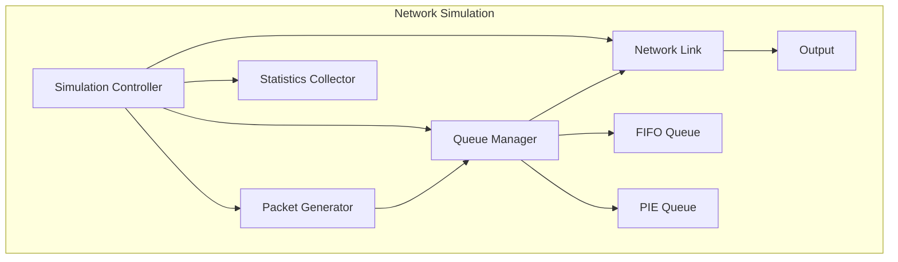

# Network Queue Management Simulation
## Project Presentation

---

## Slide 1: Project Overview
- **Title**: Network Queue Management Simulation
- **Subtitle**: Comparing FIFO and PIE Algorithms
- **Key Points**:
  - Network simulation implementation
  - Two queue management algorithms
  - Performance analysis and visualization
  - Real-time statistics tracking

---

## Slide 2: Problem Statement
- **Network Congestion Challenges**:
  - Bufferbloat problem
  - Packet loss
  - Queue delay
  - Network performance degradation
- **Solution Approach**:
  - Active Queue Management (AQM)
  - PIE algorithm implementation
  - Performance optimization

---

## Slide 3: System Architecture


---

## Slide 4: FIFO Algorithm
- **First-In-First-Out Implementation**:
  - Simple queue management
  - Tail-drop mechanism
  - Fixed queue capacity
- **Mathematical Model**:
```
Q(t) = min(Q(t-1) + A(t) - D(t), C)
```
- **Key Characteristics**:
  - No packet prioritization
  - Simple implementation
  - Predictable behavior

---

## Slide 5: PIE Algorithm
- **Proportional Integral controller Enhanced**:
  - Active queue management
  - Delay-based control
  - Dynamic drop probability
- **Key Components**:
  - Delay calculation
  - Error signal generation
  - Drop probability update
  - Dynamic threshold adjustment

---

## Slide 6: Implementation Details
- **Core Classes**:
  - Packet
  - EventLogger
  - NetworkLink
  - Queue Management
  - StatisticsCollector
- **Thread Management**:
  - Generator thread
  - Processor thread
  - Statistics thread
- **Configuration Parameters**:
  - Queue capacity: 500 packets
  - Network speed: 100 Mbps
  - Processing speed: 200 Mbps

---

## Slide 7: Performance Metrics
- **Key Measurements**:
  - Throughput (packets/second)
  - Queue size
  - Drop probability
  - Queue delay
- **Visualization**:
  - Real-time plots
  - Performance trends
  - Comparative analysis

---

## Slide 8: Results Analysis
- **FIFO Performance**:
  - Linear queue growth
  - Sudden drop rate increase
  - Fixed buffer utilization
- **PIE Performance**:
  - Controlled queue growth
  - Gradual drop rate adjustment
  - Dynamic buffer management

---

## Slide 9: Comparison and Benefits
- **FIFO Advantages**:
  - Simple implementation
  - Predictable behavior
  - Low overhead
- **PIE Advantages**:
  - Better delay control
  - Reduced bufferbloat
  - Adaptive to network conditions
- **Performance Improvements**:
  - Reduced packet loss
  - Lower queue delay
  - Better throughput

---

## Slide 10: Future Enhancements
- **Planned Improvements**:
  - Additional AQM algorithms
  - Enhanced traffic patterns
  - Network topology simulation
  - Real-time visualization
  - Performance optimization
- **Research Directions**:
  - Machine learning integration
  - Advanced traffic modeling
  - Distributed queue management

---

## Design Notes for PowerPoint

### Color Scheme
- Primary: #2C3E50 (Dark Blue)
- Secondary: #3498DB (Light Blue)
- Accent: #E74C3C (Red)
- Background: #ECF0F1 (Light Gray)

### Typography
- Headings: Arial Bold, 44pt
- Subheadings: Arial, 32pt
- Body text: Arial, 24pt
- Code: Consolas, 20pt

### Layout Guidelines
- Use consistent margins (1 inch)
- Maintain visual hierarchy
- Include relevant diagrams
- Use bullet points for clarity
- Add transition effects between slides

### Diagram Styling
- Use consistent colors
- Add clear labels
- Include legends where needed
- Maintain proper spacing
- Use appropriate arrow styles

### Animation Suggestions
- Fade in for text
- Slide transitions
- Build sequences for complex diagrams
- Highlight important points
- Smooth transitions between slides

### Additional Tips
1. Include a title slide with project logo
2. Add page numbers
3. Include references
4. Add speaker notes
5. Include a conclusion slide
6. Add a Q&A slide at the end

This template provides a comprehensive structure for your presentation. You can use it to create a professional PowerPoint presentation that effectively communicates your project's details, implementation, and results. 