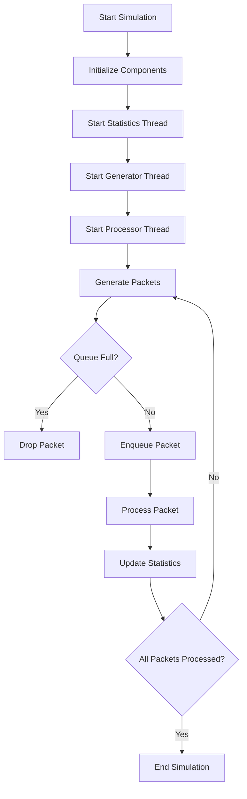

# Simulation Flow

[Back to Project Overview](project.md)

## Simulation Flowchart

## Description
This flowchart shows the main steps in the simulation process, from initialization to packet processing and statistics collection. 