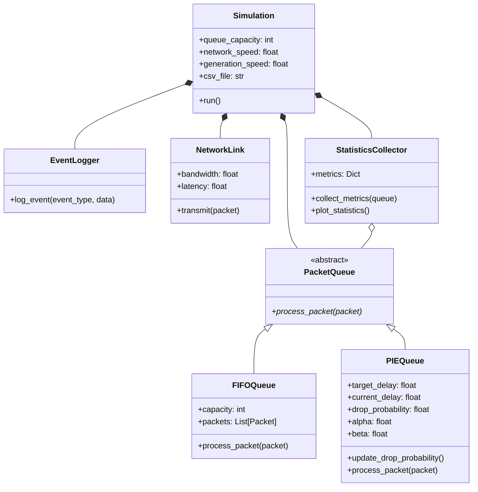

# Project Structure

[Back to Project Overview](project.md)

## Class Hierarchy Diagram

## Description
This diagram shows the main classes and their relationships in the project. Use the links above to explore specific components. 