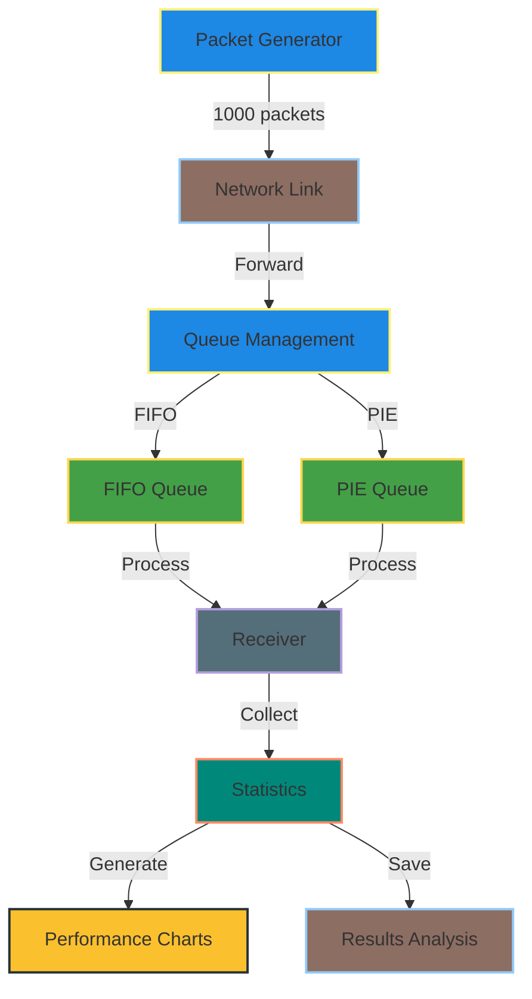

```mermaid
graph TD
    A[Packet Generator] -->|1000 packets| E[Network Link]
    E -->|Forward| B[Queue Management]
    B -->|FIFO| C[FIFO Queue]
    B -->|PIE| D[PIE Queue]
    C -->|Process| F[Receiver]
    D -->|Process| F
    F -->|Collect| G[Statistics]
    G -->|Generate| H[Performance Charts]
    G -->|Save| I[Results Analysis]

     style A fill:#1e88e5,stroke:#fff176,stroke-width:2px
    style E fill:#8d6e63,stroke:#90caf9,stroke-width:2px
    style B fill:#1e88e5,stroke:#fff176,stroke-width:2px
    style C fill:#43a047,stroke:#ffd54f,stroke-width:2px
    style D fill:#43a047,stroke:#ffd54f,stroke-width:2px
    style F fill:#546e7a,stroke:#b39ddb,stroke-width:2px
    style G fill:#00897b,stroke:#ff8a65,stroke-width:2px
    style H fill:#fbc02d,stroke:#263238,stroke-width:2px
    style I fill:#8d6e63,stroke:#90caf9,stroke-width:2px
```
